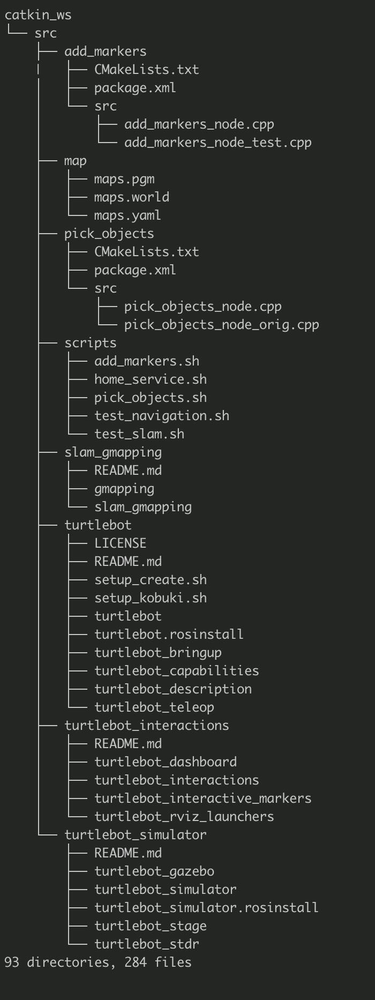

# Home Service Robot

Final Project for Robotics Software Engineer

**Pick_Up_Zone**

**Drop_Off_Zone**

**Project Definition**

The robot must navigate desired pick-up zone to pick up the objects and deliver them to the drop-off zone. To navigate from source to destination, the robot first computes the shortest route path planning from source to destination. When the robot is traveling to its destination, it must constantly monitor its atmospheric surroundings and the robot has to reach its destination without hitting/crashing on obstacles.

In this project, the following software simulator and packages are used:
1.	Gazebo - Robot simulation tool.
2.	ROS package – Kinetic
3.	Platform OS – Ubuntu
4.	Software languages Used – Python, C++
5.	Robot software package – TurtleBot (https://www.turtlebot.com/)

Following git-hub ROS packages are used:
1.	https://github.com/ros-perception/slam_gmapping
2.	https://github.com/turtlebot/turtlebot
3.	https://github.com/turtlebot/turtlebot_interactions
4.	https://github.com/turtlebot/turtlebot_simulator

### Directory_Layout

### To Clone
git clone https://github.com/balajimohan80/home_service_robot.git

### To run scripts
cd home_service_robot/catkin_ws/src/scripts

### Script directory has following scripts to launch:
1. test_slam.sh - Create a functional map of the environment which would be used for localization and navigation tasks.
2. test_navigation.sh - The robot could navigate in the environment after a 2D Nav Goal command is issued in RVIZ.
3. pick_objects.sh - The robot travels to the desired pickup zone, displays a message that it reached its destination, waits 5 seconds, travels to the desired drop off zone, and displays a message that it reached the drop off zone.
4. add_markers.sh - The marker should initially be published at the pickup zone. After 5 seconds it should be hidden. Then after another 5 seconds it should appear at the drop off zone.
5. home_service.sh - At launch, initially show the marker at pickup zone. After robot reached to pickup zone, hide the objects at pickup zone and wait for 5 seconds to simulate drop-off zone. After robot reached to drop-off zone, marked will display the objects in RVIZ.

